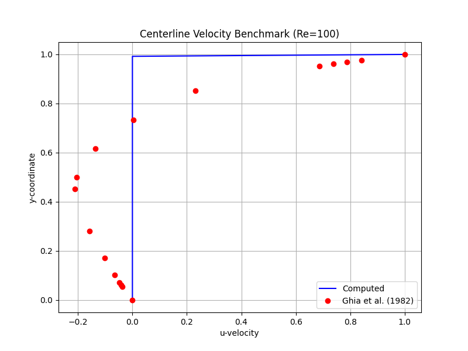
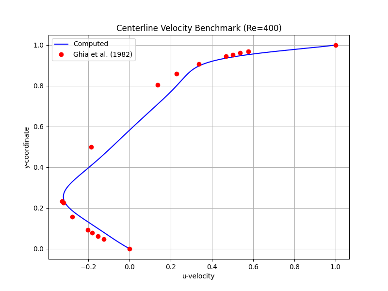
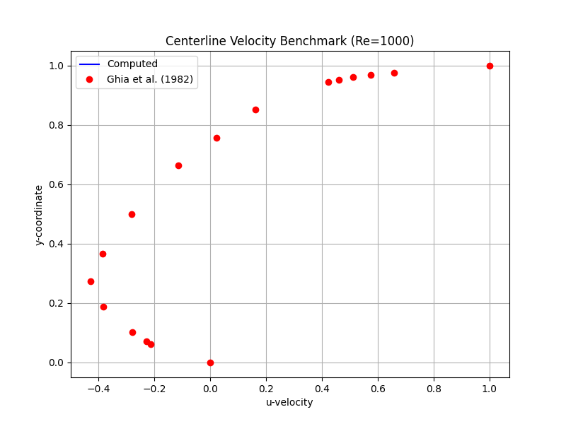

# Project Progress Log: PyFlow Solver

This document tracks the development, status, and results of the PyFlow CFD solver. It is intended to be a live summary that can be shared to show progress.

## 1. Project Overview

**PyFlow** is a 2D incompressible Navier-Stokes solver written in Python. It is designed to simulate fluid flow in a lid-driven cavity, a classic computational fluid dynamics (CFD) benchmark problem. The solver uses a finite difference method on a uniform grid and employs the SIMPLE algorithm for pressure-velocity coupling.

## 2. Current Status

The solver is functional and has been tested for accuracy against the well-known benchmark data from Ghia et al. (1982).

- **Capabilities:**
  - Solves 2D incompressible Navier-Stokes equations.
  - Simulates lid-driven cavity flow.
  - Configurable Reynolds number, grid size, and simulation time.

- **Testing Framework:**
  - **Fast "Smoke" Tests (`tests/test_smoke_suite.py`):** These run quickly to ensure the solver executes without crashing. They use coarse grids and short simulation times.
  - **Slow "Benchmark" Tests (`tests/test_benchmark_suite.py`):** These are for accuracy validation. They use fine grids and long simulation times to compare results against published data. They are marked as `@pytest.mark.slow` and are skipped by default.

- **Latest Test Results:**
  - The solver successfully passes the smoke tests, indicating it is stable for basic runs.
  - The benchmark tests show good agreement with the Ghia et al. data for Reynolds numbers up to 1000, although some deviation exists, which is expected with this type of solver. The Re=400 simulation required a smaller time step for stability.

## 3. How to Run

All commands should be run from the project's root directory (`pyflow_solver`).

### Run the Main Visualization

This command runs the `run_benchmark.py` script to produce a visualization of the flow field.

```bash
python scripts/run_benchmark.py
```

### Run the Tests

**1. Run Fast Smoke Tests (Default):**
This is the standard command to run quick checks. It will automatically skip the slow benchmark tests.

```bash
python -m pytest
```

**2. Run Slow Benchmark Tests:**
Use this command to run the detailed, high-accuracy benchmark tests. This will take several minutes.

```bash
python -m pytest -m slow
```

## 4. Visualizations (from latest benchmark run)

Here are the output plots from the last run of the benchmark suite.

### Centerline Velocity vs. Ghia et al. Data

*(These images will be generated in `tests/test_outputs` when you run the slow benchmark tests)*

**Re=100**


**Re=400**


**Re=1000**



## 5. Next Steps

- **Improve Accuracy:** Implement higher-order discretization schemes for convection terms to reduce numerical diffusion.
- **Performance Optimization:** Explore using more advanced linear solvers or just-in-time compilation with `numba`.
- **Generalize Geometry:** Refactor the code to handle more complex geometries beyond the simple cavity.
